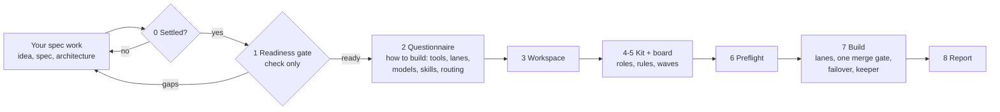
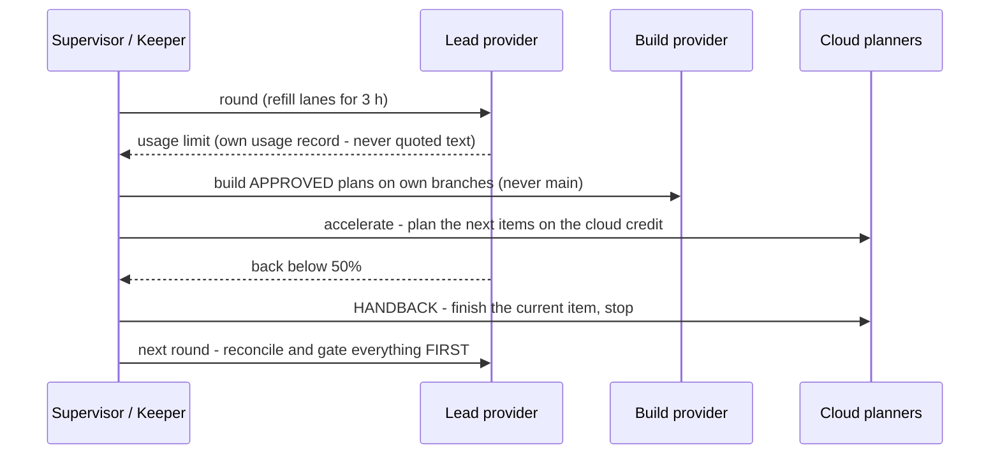

<div align="center">

# AI Orchestrator Skill

**Your spec is done. Now build it with a team of AI agents - without the rework, the lost state, or the 3 a.m. questions.**

[](LICENSE)
[](https://github.com/christian281150/AI-orchestrator_skill/actions/workflows/tests.yml)
[](https://agentskills.io/specification)
[](#get-the-skill)
[](https://www.python.org/)
[](#whats-inside)
[](https://github.com/christian281150/AI-orchestrator_skill/discussions)

**[Get the skill](#get-the-skill)** · [How it works](#how-it-works) · [Which tool when](#which-tool-when) · [A personal note](#a-personal-note) · [Give feedback](https://github.com/christian281150/AI-orchestrator_skill/discussions)

</div>

---

> [!IMPORTANT]
> **This is not a tool to work out your spec.** It starts when the **idea, the functional spec (features and
> acceptance criteria) and the architecture are settled**. It never writes, refines or aligns them - if they have
> gaps, it stops and hands you a gap list for your own spec work. What it does is everything after that: **the
> build.**

AI coding agents are fast. Running **many** of them on one real app is where it falls apart:

- they **forget** - every session, round and subagent starts from whatever was written down
- they **redo work** - two lanes build the same thing, or a new session restarts a half-done item
- they **guess** - every gap becomes wrong code, or a question to you at 3 a.m.
- they **stall** - the first usage limit stops the whole build until someone notices
- each tool is used for **everything**, instead of for what it does best at the lowest cost
- and **you** become the bottleneck, answering questions one at a time

This repository is a **skill** (the [`build-orchestration-setup`](skills/build-orchestration-setup/SKILL.md)
folder, in the open [Agent Skills](https://agentskills.io/specification) format) plus a **zero-dependency
toolkit**. It checks your settled spec is ready to build, walks you through *how* you want to build it (tools,
lanes, models, skills), sets everything up and runs it: parallel lanes, one merge gate, each AI tool on the work
it does best, automatic failover on usage limits, and reporting you can read without asking.

It comes out of a real multi-week build - up to **10 parallel lead lanes plus build lanes on a second AI
provider, cloud planners and a keeper process**, running unattended on one PC. Every rule in it paid for itself
at least once; the [45 lessons](skills/build-orchestration-setup/references/08-lessons-learned.md) are included.

## Get the skill

| Where you work | How |
|---|---|
| **Claude Code** | `/plugin marketplace add christian281150/AI-orchestrator_skill` then `/plugin install ai-orchestrator@ai-orchestrator` - adds the skill plus `/orchestrate` and `/build-status` |
| **Claude apps** (claude.ai, desktop, Cowork) | download `build-orchestration-setup.zip` from the [latest release](https://github.com/christian281150/AI-orchestrator_skill/releases/latest) and upload it in the app's skill settings |
| **Any agent** (Codex, Cursor, Gemini CLI, ...) | `npx skills add christian281150/AI-orchestrator_skill` ([skills CLI](https://github.com/vercel-labs/skills)) |
| **Try without installing** | `npx skills use christian281150/AI-orchestrator_skill@build-orchestration-setup \| claude` |
| **Manual** | copy [`skills/build-orchestration-setup/`](skills/build-orchestration-setup) into your agent's skills folder |

Then, in a repository that already holds your spec and architecture:
```text
/orchestrate docs/
```
or just say: *"My spec and architecture are in docs/ - set up the build orchestration."*

## How it works



| Phase | What you get |
|---|---|
| **0 Prerequisites** | Stops unless idea, spec and architecture exist and are settled. |
| **1 Readiness gate** | A *check*, not spec work: a 12-point scorecard, a gap list handed back to you if anything is missing, and the **build order** (P1 / P2 / P3, not-in-v1). |
| **2 Questionnaire** | Ten short rounds about *how* to build: project and people, where it runs, **adoption level**, which tools lead and which build, scale, cost vs quality, **skills** (scan what's installed, use your ideas, propose the rest), limits and failover, **which tool does what**, guardrails, reporting. |
| **3 Workspace** | Folders, git with line endings and hooks before the first commit, credentials as environment variables, tools checked against their `--help`, a separate test database, schedulers. |
| **4-5 Kit + board** | Board, rules, coordinator prompt, engine-neutral roles, skills plan, ledgers, config; work in waves with estimates, dependencies and risk tiers. |
| **6 Prove it** | `preflight` - every check shown going red on a broken input - plus one dry round. |
| **7 Build** | Rounds with parallel lanes and one merge gate; a keeper every ~10 min; reconciliation of work the lead didn't see. |
| **8 Report** | P1 progress headline, board, decisions log, dashboard, handovers, one batch of decisions for you. |

## Adapt it to your build

Everything beyond level 1 is optional. The skill recommends the lowest level that fits.

| Level | What runs | Fits |
|---|---|---|
| **1 Rituals** | board, decisions log, ledgers, handovers, rules, roles - agents in one chat or CLI session | small builds, a first try |
| **2 Unattended** | + supervisor (rounds, restart, STOP file), git hooks, preflight | one provider, runs while you're away |
| **3 Multi-provider** | + build providers, failover, knowledge-gap reconciliation | two or more AI subscriptions |
| **4 Full** | + keeper every ~10 min, cloud planners, idle planning, dashboard | long builds, maximum throughput |

Every tool name in the templates is an example. Swap in your own: any CLI agent can be the lead provider or a
build provider in `orchestration.toml`.

## Which tool when

The routing the skill proposes (the full table is in [`10-tool-routing.md`](skills/build-orchestration-setup/references/10-tool-routing.md)):

| Work | Goes to | Why |
|---|---|---|
| Deciding scope, features, architecture | **you - before this skill** | the build executes decisions; it doesn't make them |
| Coordinating, reviewing, merging, arbitrating | the **lead provider**, top model tier | one gate sees everything that reaches main |
| Planning | the lead's planner; **cloud sessions** when the lead is busy or limited; an **idle build provider** for safe items | plans are cheap, wrong builds are not |
| Implementing approved plans, easier work, fixes | **build providers**, cheaper tier | saves the lead's allowance for judgment |
| Security, auth, money, data, anything live | the lead, top tier, adversarial review | risk tier 3 is never delegated |
| Needs your machine (local DB, secrets, LAN) | local tools only | cloud sessions can't see it |
| Keeping it all running | supervisor + **keeper** (OS scheduler) | no human restarting things at night |
| Writes to live, money, publishing, deleting | **you** | reserved actions |

Work by anyone other than the lead is **reconciled** before it is built on: every round starts with a
knowledge-gap check, and foreign plans get a blind re-plan by the lead plus an arbiter's ruling.

## Failover: the build never just stops



## What's inside

```text
skills/build-orchestration-setup/   THE SKILL
  SKILL.md                          the phases
  references/                       10 files, loaded on demand (readiness gate ... tool routing)
  scripts/orch.py                   the toolkit - Python 3.11+ standard library only
  assets/templates/                 copied into your repo by `orch.py init`
commands/                           /orchestrate, /build-status (Claude Code)
.claude-plugin/ .codex-plugin/ .cursor-plugin/   plugin manifests
examples/lunch-poll/                a filled-in example setup
tests/                              pytest suite
```

| Toolkit command | Does |
|---|---|
| `init <repo>` / `unfilled` | copy templates + tools (never overwrite, hooks, author) / list placeholders left |
| `skills [repo]` | installed skills per engine; skills agent files name but lack |
| `preflight` | everything a round depends on - PASS / WARN / FAIL |
| `supervise` | unattended rounds: limit detection, fallback build lanes, gate, re-exec on change, STOP file |
| `keeper` | one scheduled pass: restarts, build lanes, idle planning, cloud planners steady / accelerate / handback |
| `gap` | knowledge gap: work the lead didn't see, and `REVIEWERS=<n>` |
| `board validate · ready · metrics` / `check-not-done <ID>` | board consistency, next work by priority, progress / never do a task twice |
| `safe-commit` · `redact` · `snapshot` · `live-view` | safe side-commits · proven secret scan · progress JSON · local status page |

## A personal note

This is **my personal approach to AI orchestration**. I built it while running a real multi-week software
build with several AI agents in parallel, and I learned most of it the hard way - the lessons file is the
receipt. It is not an official method and not the only way to do this. It is what worked for me, written down
so the next build starts where the last one ended.

**I'd be really happy about your feedback - and even happier if you give it a shot.** Try it on a toy
project or a real one and tell me how it went: what worked, what broke, what you'd do differently, which tool
routing works for your setup. Every report helps me deepen my understanding of how to orchestrate AI agents
well, and it makes this better for everyone who uses it.

- 💬 **Share an experience, ask a question, suggest an idea:** [Discussions](https://github.com/christian281150/AI-orchestrator_skill/discussions)
- 🐞 **Something doesn't work:** [open an issue](https://github.com/christian281150/AI-orchestrator_skill/issues/new/choose)
- 📓 **A failure mode you hit with your own agents:** use the *Lesson from a real build* issue template
- ⭐ **Useful to you?** A star helps others find it.

## FAQ

**Can it help me write or sharpen my spec?** No, on purpose. Do that first with whatever you use for spec work;
this skill starts when it's settled, and tells you what's missing if it isn't.

**Do I need several AI subscriptions?** No. Levels 1 and 2 work with one tool. A second provider keeps the build
going when the first hits its limit and multiplies build capacity.

**Will agents touch production?** Not under the default rules. Writes to live systems, money, publishing,
deleting and credentials are *reserved actions*: agents prepare them and queue them for you.

**Windows?** Yes - it was born there. The toolkit is Python; Task Scheduler, launchd and systemd templates are included.

## Verified and not verified

- **Test suite** (36 tests; CI on Linux, macOS and Windows with Python 3.11 and 3.13): supervisor runs with
  stand-in providers (limit hit, build provider takeover, gate in the next round, STOP, repeated-failure stop);
  keeper passes (restart capped per day, build lanes, idle planning never touching unsafe lanes, cloud planners
  steady / accelerate / handback / credit floor); knowledge-gap reconciliation; git hook controls; safe-commit
  during a merge; preflight going red; skills inventory; manifests and one version everywhere; the example.
- **In CI on every push:** `ruff` lint and the Agent Skills reference validator (`skills-ref validate`).
- **By hand:** `claude plugin validate` passes (one expected warning: the root `CLAUDE.md` is for contributors, not plugin context); installing from GitHub via `/plugin marketplace add` delivers the
  skill and both commands; the skills CLI discovers the skill.
- **Not verified by the tests:** real agent CLIs (flags and usage formats change between versions - check every
  command in `orchestration.toml` against `<cli> --help`), cloud-session launch commands, the Codex and Cursor
  manifests inside those apps, and the OS scheduler templates.

## Contributing · Security · License
Issues, lessons from your own builds and pull requests are welcome - see [CONTRIBUTING.md](CONTRIBUTING.md),
[AGENTS.md](AGENTS.md) (rules for AI agents working on this repo) and the [Code of Conduct](CODE_OF_CONDUCT.md).
Report vulnerabilities privately - see [SECURITY.md](SECURITY.md). Release downloads ship with a checksum and a
signed build-provenance attestation (`gh attestation verify build-orchestration-setup.zip -R christian281150/AI-orchestrator_skill`).

[MIT](LICENSE) © 2026 christian281150 and contributors. Claude, Codex, Gemini and Cursor are trademarks of their
respective owners; this project is independent and not affiliated with or endorsed by any of them
([NOTICE](NOTICE.md)). Built on the open [Agent Skills](https://agentskills.io/specification) format; pairs
well with process-skill libraries such as [obra/superpowers](https://github.com/obra/superpowers).
