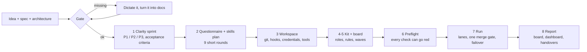
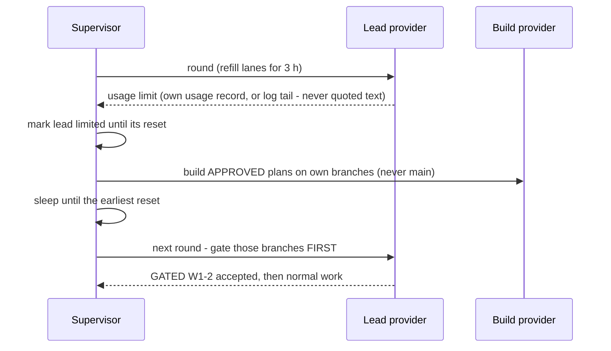

<div align="center">

# Agent Build Orchestrator

**From finished spec to shipped code with a team of AI agents - without the rework, the lost state, or the 3 a.m. questions.**

[](LICENSE)
[](https://github.com/christian281150/agent-build-orchestrator/actions/workflows/tests.yml)
[](https://www.python.org/)
[](https://agentskills.io/specification)
[](#claude-code)
[](#whats-inside)

```text
/plugin marketplace add christian281150/agent-build-orchestrator
/plugin install agent-build-orchestrator@agent-build-orchestrator
```

</div>

---

AI coding agents are fast. Running **many** of them on one real app is where it falls apart:

- they **forget** - every session, round and subagent starts from whatever was written down
- they **redo work** - two lanes build the same thing, or a new session restarts a half-done item
- they **guess** - every gap in the spec becomes wrong code, or a question to you at 3 a.m.
- they **stall** - the first usage limit stops the whole build until someone notices
- and **you** become the bottleneck, answering questions one at a time

**Agent Build Orchestrator** is a skill plus a zero-dependency toolkit that fixes this. It first makes your spec
buildable, then walks you through how you want the build to run, then sets up and runs it: parallel lanes, one
merge gate, automatic failover between providers, and reporting you can read without asking.

It came out of a real multi-week build: up to **10 parallel lead lanes on one provider plus build lanes on a
second**, running unattended on one PC. Every rule in it paid for itself at least once - the
[38 lessons](skills/build-orchestration-setup/references/08-lessons-learned.md) are included.

## Contents
- [How it works](#how-it-works)
- [Install](#install)
- [Usage](#usage)
- [What's inside](#whats-inside)
- [Failover: the build never just stops](#failover-the-build-never-just-stops)
- [Philosophy](#philosophy)
- [Compatibility](#compatibility)
- [FAQ](#faq)
- [Verified and not verified](#verified-and-not-verified)
- [Contributing](#contributing) · [Security](#security) · [License](#license)

## How it works



| Phase | What you get |
|---|---|
| **0 Gate** | Refuses to start without idea, spec and architecture. Offers to take them by dictation. |
| **1 Clarity sprint** | Readiness scorecard, ambiguity hunt (one question at a time, with a recommendation), **P1 / P2 / P3** + a written *not-in-v1* list, given/when/then criteria for every must-have, decisions made up front. |
| **2 Questionnaire** | Nine short rounds: project and people, where it runs, which tools lead and which build, scale, cost vs quality, **skills** (scan what's installed, use your ideas, propose the rest), limits and failover, guardrails, reporting. |
| **3 Workspace** | Folder layout, line endings and hooks before the first commit, credentials as environment variables, tools checked against their `--help`, a separate test database, schedulers. |
| **4-5 Kit + board** | Board, rules, coordinator prompt, engine-neutral roles rendered per tool, skills plan, ledgers, config. Work broken into waves with estimates, dependencies and risk tiers. |
| **6 Prove it** | `preflight` - each check shown going red on a broken input - plus one dry round. |
| **7 Run** | Unattended rounds: parallel lanes, one merge gate, provider failover, automatic restart. |
| **8 Report** | P1 progress headline, board, decisions log, dashboard, handovers, one batch of decisions for you. |

## Install

### Claude Code
```text
/plugin marketplace add christian281150/agent-build-orchestrator
/plugin install agent-build-orchestrator@agent-build-orchestrator
```
This adds the skill and two commands: `/orchestrate` and `/build-status`.

### Claude apps (claude.ai, desktop, Cowork)
Download `build-orchestration-setup.zip` from the [latest release](https://github.com/christian281150/agent-build-orchestrator/releases/latest)
and upload it in the app's skill settings. (No release yet? Zip the folder `skills/build-orchestration-setup/`.)

### Codex, Cursor and other agents
The repository ships `.codex-plugin/` and `.cursor-plugin/` manifests pointing at `./skills/`. Or copy
`skills/build-orchestration-setup/` into the agent's skills folder (e.g. `~/.agents/skills/`). With the
skills CLI:
```bash
npx skills add christian281150/agent-build-orchestrator
```

### Toolkit only
Python 3.11+, standard library only - no install step:
```bash
python skills/build-orchestration-setup/kit/tools/orch.py -h
```

## Usage

```text
/orchestrate docs/
```
or just say: *"Set up the build orchestration for my app - the spec is in docs/."*

The skill checks your documents, runs the clarity sprint, asks its questions (each with a recommended answer),
generates the kit into your repository and proves the setup before anything runs unattended. Later:

```text
/build-status
```
reads the board, the decisions log and the supervisor state and tells you where the build stands and what is
waiting on you.

See [`examples/lunch-poll`](examples/lunch-poll) for a filled-in setup: scope, questionnaire answers, skills
plan, provider config and the first board.

## What's inside

```text
.claude-plugin/ .codex-plugin/ .cursor-plugin/   plugin manifests
commands/                                        /orchestrate, /build-status
skills/build-orchestration-setup/
  SKILL.md                                       the phases
  references/                                    the detail behind each phase (9 files)
  kit/templates/                                 copied into your repo by `orch.py init`
  kit/tools/orch.py                              the toolkit - Python stdlib only
examples/lunch-poll/                             a worked example
tests/                                           pytest suite
```

**References**

| File | Covers |
|---|---|
| [01-spec-clarity](skills/build-orchestration-setup/references/01-spec-clarity.md) | scorecard, ambiguity hunt, P1/P2/P3, acceptance criteria, gate |
| [02-questionnaire](skills/build-orchestration-setup/references/02-questionnaire.md) | all nine rounds with options and recommendations |
| [03-workspace-setup](skills/build-orchestration-setup/references/03-workspace-setup.md) | folders, git, credentials, tools, test environment, schedulers |
| [04-roles-and-pipeline](skills/build-orchestration-setup/references/04-roles-and-pipeline.md) | 12 roles, lanes, dispatch shape, pipeline, round sizing |
| [05-memory-and-no-double-work](skills/build-orchestration-setup/references/05-memory-and-no-double-work.md) | where every fact lives, the rituals, never twice |
| [06-provider-failover](skills/build-orchestration-setup/references/06-provider-failover.md) | limit detection, fallback lanes, the gate, chat-only models |
| [07-reporting](skills/build-orchestration-setup/references/07-reporting.md) | the metric, dashboard, live view, handovers |
| [08-lessons-learned](skills/build-orchestration-setup/references/08-lessons-learned.md) | 38 failure modes and what now prevents each |
| [09-skills-and-cost-quality](skills/build-orchestration-setup/references/09-skills-and-cost-quality.md) | skills plan, model tier per role, review depth by risk |

**Toolkit** - `python tools/orch.py <command>` once `init` has copied it into your repo

| Command | Does |
|---|---|
| `init <repo>` | copy templates + tools, never overwrite, wire git hooks, set the author |
| `unfilled` | list `{{TODO}}` placeholders the setup still has to fill |
| `skills [repo]` | installed skills per engine; skills agent files name but lack |
| `preflight` | board valid, hooks wired, author, CLIs on PATH, skills installed, env vars present, state outside the repo, RAM |
| `supervise` | the unattended round loop: limit detection, fallback lanes, gate, re-exec on change, STOP file, stop after 3 identical failures |
| `board validate · ready · metrics` | consistency (done needs a commit hash), next work by priority, shipped % |
| `check-not-done <ID>` | evidence an item is not already done or owned: board, git log, branches, ledger |
| `safe-commit -m msg <paths>` | commit only these paths; waits while a merge is in progress |
| `redact control · scan · apply <file>` | proven secret scan before anything leaves the machine |
| `snapshot` · `live-view` | read-only progress JSON · self-refreshing local status page |

## Failover: the build never just stops



One merge gate. Build providers never plan, merge, touch the board, live systems or credentials. The
supervisor starts at logon, restarts on failure, re-execs itself when its rules change, and stops cleanly on a
`STOP` file - it never kills a running round.

## Philosophy

- **Clarity before code.** An hour of questions before round 1 saves many agent-hours after it.
- **Measured, not inferred.** Every check has a control that can go red. Skips are not passes.
- **Never pay twice.** Check before starting; commit, tick and log in the same turn; ledgers over memory.
- **The repository is the truth.** Status lives on the board, decisions in the log, never in a chat.
- **One merge gate.** Many builders, one reviewer of what reaches main.
- **Best quality at the lowest cost.** Cheapest adequate model per role, review depth by risk, the fewest skills per task.
- **The owner is the bottleneck.** Decide and log; ask only for what can't be undone, in one batch.

## Compatibility

| Tool | Loads the skill | Lead provider in `supervise` | Build provider | How it's covered |
|---|---|---|---|---|
| Claude Code | plugin / skills folder | example config | example config | `claude plugin validate` passes; local marketplace install tested (skill + both commands) |
| Claude apps | skill zip upload | - | - | Agent Skills format, checked by tests |
| Codex CLI | `.codex-plugin` / skills folder | configurable | example config, usage-record reader | manifest only; reader tested on sample records |
| Gemini CLI | skills folder | configurable | example config (off) | template only |
| Cursor | `.cursor-plugin` | - | - | manifest only |
| Any other CLI agent | skills folder | add to `orchestration.toml` | add to `orchestration.toml` | provider-neutral by design |

## FAQ

**Do I need Claude *and* Codex?** No. One provider works. A second one keeps the build going when the first hits
its limit and multiplies build capacity.

**Does it write my spec?** No - it makes an existing spec buildable. If you have the knowledge but not the
documents, it offers to take them by dictation.

**Will agents touch production?** Not under the default rules. Writes to live systems, money, publishing,
deleting and credentials are *reserved actions*: agents prepare them and queue them for you.

**Can I use it for a small app?** Yes - see the lunch-poll example. Choose chat-driven or 2-3 lanes and skip the dashboard.

**Windows?** Yes - it was born there. The toolkit is Python; a Task Scheduler script is included, plus launchd and systemd templates.

## Verified and not verified

- **Verified by the test suite** (29 tests; run locally on Linux - the CI workflow runs them on Linux, macOS and Windows on every push): unit tests and end-to-end supervisor
  runs with stand-in providers - a limit hit, a build provider taking over, the gate in the next round, the STOP
  file, the stop after repeated failures - plus git hook controls, safe-commit during a merge, preflight going red,
  the skills inventory, manifest validity, one version everywhere, the worked example.
- **Verified by hand:** `claude plugin validate` passes for the marketplace and plugin manifests, and a
  marketplace install from a local copy installs the skill and both commands.
- **Not verified by the tests:** the real agent CLIs (their flags and usage-record formats change between
  versions - check each command in `orchestration.toml` against `<cli> --help`), the Codex and Cursor plugin
  manifests inside those apps, and the OS scheduler templates.

## Contributing
Issues, lessons from your own builds, and pull requests are welcome - see [CONTRIBUTING.md](CONTRIBUTING.md)
and the [Code of Conduct](CODE_OF_CONDUCT.md). There is an issue template just for **lessons from real builds**.

## Security
Report vulnerabilities privately - see [SECURITY.md](SECURITY.md), which also explains the security model
for running agents unattended.

## License
[MIT](LICENSE) © 2026 christian281150 and contributors. See [NOTICE.md](NOTICE.md) for trademarks.

Claude, Codex, Gemini and Cursor are trademarks of their respective owners. This project is independent and
not affiliated with or endorsed by any of them.

## Acknowledgements
Built on the open [Agent Skills](https://agentskills.io/specification) format. Pairs well with process-skill
libraries such as [obra/superpowers](https://github.com/obra/superpowers) - the skills plan will suggest them
where they fit.
